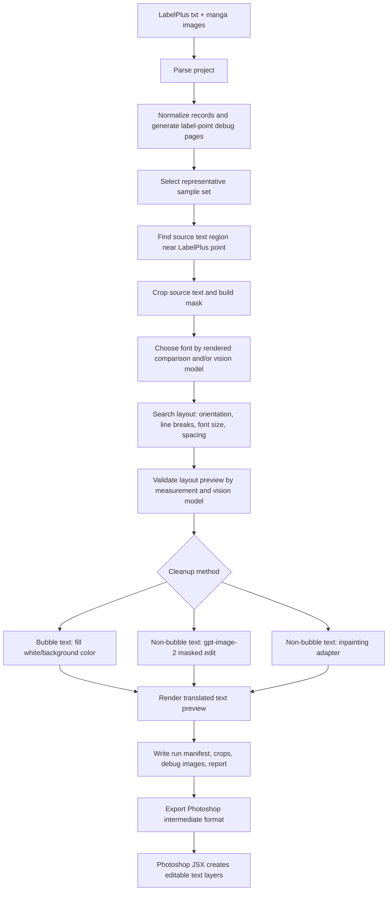

# Phase 0 Technical Route

## Goal

Build `autolettering` as an experiment-driven automatic manga lettering system for real LabelPlus translation projects.

The project should not start from a large platform. The first usable target is a small, reproducible pipeline that reads a real LabelPlus project, creates traceable intermediate artifacts, generates preview images, and records where the automatic result needs manual review.

## Current Workspace Status

- Root path: `D:\work\autolettering`.
- Root repository status: initialized as the root project Git repository during Phase 1 setup.
- Existing Git repositories under the root:
  - `LabelPlus/`
  - `PS-Script/`
  - `BallonsTranslator/`
  - `gpt-image-playground/`
- Project data/resource directories without their own Git repository:
  - `GBC06 (已翻 斗笠)/`
  - `工具箱漫画字体V2.5/`
- Root `.env` exists and contains only the variable names needed by this project. Values must never be logged or committed.

Version-control status:

- `D:\work\autolettering` is the root project repository for the new `autolettering` code.
- Local reference projects, real sample assets, fonts, `.env`, and generated outputs are ignored by the root project repository.
- `git push` still requires a configured remote. No remote was available at the time this route was written.

## Resource Inventory

### LabelPlus Source

`LabelPlus/` is the original LabelPlus desktop application source.

Relevant files:

- `LabelPlus/LabelPlus/LabelFileManager.cs`
  - `getStrlineType()` parses page and label headers.
  - `addLabelToStore()` converts parsed header values into label items.
  - `ToFile()` writes LabelPlus text with page headers and label headers.
- `LabelPlus/LabelPlus/LabelItem.cs`
  - Defines the core label item data used by LabelPlus.

Confirmed format behavior from source:

- Page header: `>>>>>>>>[image_filename]<<<<<<<<`
- Label header: `----------------[index]----------------[x,y,group]`
- `x` and `y` are stored as image-relative percentages.
- `group` maps to a group name defined in the text file header block.

### Photoshop Script

`PS-Script/` is LabelPlus Photoshop import/export tooling.

Relevant files:

- `PS-Script/src/text_parser.ts`
  - `lpTextParser()` parses LabelPlus text or JSON.
  - `judgeLineType()` detects file headers and label headers.
  - `readStartBlocks()` reads version, group list, and comment blocks.
- `PS-Script/src/importer.ts`
  - `importFiles()` drives LabelPlus text import into Photoshop.
  - `importImage()` iterates labels for one image.
  - `importLabel()` creates one text layer per label.
  - `newTextLayer()` creates a Photoshop text layer and sets content, position, font, size, direction, and layer group.
- `PS-Script/src/dialog_clear.ts`
  - Existing experimental dialog cleanup logic based on label positions.

Confirmed behavior:

- The current script places text at `doc.width * x` and `doc.height * y`.
- It can use template layers, font, size, text direction, auto-leading, selected groups, and label-index output.
- It does not carry the richer per-label parameters needed by this project: detected text bbox, chosen font per record, measured font size, line breaks, letter spacing, rotation angle, cleanup method, validation status, or before/after crop paths.

### Real LabelPlus Sample

`GBC06 (已翻 斗笠)/` contains the current real sample project.

Files found:

- `翻译_0.txt`
- 19 PNG images:
  - `GBC06_01.png`
  - `GBC06_02.png`
  - `GBC06_03.png`
  - `GBC06_04.png`
  - `GBC06_05.png`
  - `GBC06_06.png`
  - `GBC06_07.png`
  - `GBC06_14.png`
  - `GBC06_15.png`
  - `GBC06_16.png`
  - `GBC06_17.png`
  - `GBC06_18.png`
  - `GBC06_19.png`
  - `GBC06_20.png`
  - `GBC06_21.png`
  - `GBC06_22.png`
  - `GBC06_29.png`
  - `GBC06_30.png`
  - `GBC06_33.png`

Sample image dimensions:

- All available PNG images are `1440 x 2048`.

Parsed sample facts:

- Groups declared in header:
  - `框内`
  - `框外`
- Page headers in `翻译_0.txt`: 33
- Available local PNG images: 19
- Label records in text file: 268
- Group 1 / `框内`: 186 records
- Group 2 / `框外`: 82 records

Important mismatch:

- `翻译_0.txt` declares more pages than the local image directory contains.
- Phase 1 must report missing images explicitly instead of silently skipping or failing late.

### Fonts

`工具箱漫画字体V2.5/` contains approximately 70 `.ttf` files plus reference images and update notes.

Observed font families include:

- 黑体 variants
- 宋体 variants
- 圆体 variants
- 文黑体 variants
- 伪角明 variants
- 楷体 / 超粗楷
- POP / 海报 / 综艺 / 龙珠 / 点阵 / 像素 and other display styles

Implications:

- Phase 3 should build a font index before rendering comparisons.
- The font index should include path, display/family name, filename-derived style hints, and character coverage checks.
- Font preview rendering must be cached because the same candidate fonts will be reused across many records.

### BallonsTranslator Reference

`BallonsTranslator/` is useful as a reference, but it should not be copied wholesale because its architecture targets a full GUI translation app and deep-learning manga translation workflow.

Relevant concepts:

- `ballontranslator/modules/textdetector/base.py`
  - `TextDetectorBase.detect()` returns a mask and `TextBlock` list.
- `ballontranslator/modules/textdetector/detector_ctd.py`
  - Comic Text Detector integration, including detected font-size post-processing.
- `ballontranslator/modules/inpaint/base.py`
  - `InpainterBase.inpaint()` handles whole-image and per-block inpainting, alpha handling, and simple balloon-color fill fallback.
- `ballontranslator/modules/inpaint/inpaint_default.py`
  - Built-in OpenCV, PatchMatch, AOT, LaMa and Flux inpainting registrations.
- `ballontranslator/utils/text_layout.py`
  - Layout routines that use masks and text blocks to fit translated text.
- `ballontranslator/ui/scene_textlayout.py`
  - More advanced horizontal/vertical text layout behavior in the GUI path.
- `scripts/export to photoshop/Import from BallonTranslator JSON.jsx`
  - A useful precedent for importing rich JSON data into Photoshop rather than only LabelPlus text.

Recommended reuse pattern:

- Reuse ideas and interface boundaries, not the full app architecture.
- Start with small local adapters:
  - text detection adapter returning `mask + candidate boxes`
  - inpainting adapter returning `cleaned image + method metadata`
  - layout adapter returning measurable layout candidates

### gpt-image-playground Reference

`gpt-image-playground/` is useful for `gpt-image-2` image generation/editing integration.

Relevant file:

- `gpt-image-playground/src/app/api/images/route.ts`

Observed implementation points:

- Uses the OpenAI SDK.
- Reads API key and base URL from environment variables.
- Supports `mode=edit`.
- Collects one or more `image_*` form fields.
- Optionally passes `mask` to `openai.images.edit(...)`.
- Supports streaming and non-streaming paths.
- Saves generated images to local storage when configured for filesystem mode.

Project-specific adaptation:

- This project should use separate environment variables:
  - `GPT_IMAGE_BASE_URL`
  - `GPT_IMAGE_API_KEY`
  - `GPT_IMAGE_MODEL`
- Request logs must store summaries and artifact paths, not raw secrets.

### External API Boundaries

The project depends on two external API groups:

- MIMO text/vision:
  - `MIMO_BASE_URL`
  - `MIMO_API_KEY`
  - `MIMO_TEXT_MODEL`
  - `MIMO_VISION_MODEL`
- GPT image editing:
  - `GPT_IMAGE_BASE_URL`
  - `GPT_IMAGE_API_KEY`
  - `GPT_IMAGE_MODEL`

OpenAI image-editing facts confirmed from the official image generation guide:

- Image editing uses `POST /v1/images/edits`.
- The request can include `model=gpt-image-2`, `image`, `mask`, and `prompt`.
- The mask image must have the same dimensions as the input image and include an alpha channel.
- Transparent mask regions indicate areas that can be edited; opaque regions are left unchanged.

MIMO docs pages were checked for:

- text generation with deep-thinking behavior
- multimodal image understanding with image URL/Base64 inputs

The local implementation should still wrap MIMO calls behind a small client and preserve real request/response summaries per experiment run, because final parameter details and response fields should be verified by small controlled calls during the first model-backed experiment.

## Input Format

### LabelPlus Text

Initial input is a `.txt` file such as:

```text
1,0
-
框内
框外
-
Default Comment
 You can edit me


>>>>>>>>[GBC06_01.png]<<<<<<<<
----------------[1]----------------[0.621,0.079,1]
街头演出？
```

Internal parser output should normalize this into:

```json
{
  "project_root": "D:/work/autolettering/GBC06 (已翻 斗笠)",
  "labelplus_file": "翻译_0.txt",
  "groups": ["框内", "框外"],
  "images": [
    {
      "image_name": "GBC06_01.png",
      "image_path": "D:/work/autolettering/GBC06 (已翻 斗笠)/GBC06_01.png",
      "width": 1440,
      "height": 2048,
      "labels": [
        {
          "id": "GBC06_01.png#1",
          "page_index": 1,
          "record_index": 1,
          "x_ratio": 0.621,
          "y_ratio": 0.079,
          "x_px": 894,
          "y_px": 162,
          "group_id": 1,
          "group_name": "框内",
          "translated_text": "街头演出？"
        }
      ]
    }
  ],
  "missing_images": [
    {
      "image_name": "GBC06_08.png",
      "reason": "declared in LabelPlus text but not found under project directory"
    }
  ]
}
```

### Font Inventory

Font index output should use JSON/JSONL:

```json
{
  "font_id": "toolbox-heiti-bold-v2.4",
  "path": "D:/work/autolettering/工具箱漫画字体V2.5/[toolbox]黑体-简繁-Bold(v2.4).ttf",
  "filename": "[toolbox]黑体-简繁-Bold(v2.4).ttf",
  "family_name": "resolved by font parser",
  "style_hints": ["黑体", "简繁", "Bold"],
  "supports_sample_text": true
}
```

### Rich Autolettering Manifest

Every downstream stage should update a per-run manifest. A record should be appendable and inspectable:

```json
{
  "record_id": "GBC06_01.png#1",
  "image_name": "GBC06_01.png",
  "labelplus_position": {
    "x_ratio": 0.621,
    "y_ratio": 0.079,
    "x_px": 894,
    "y_px": 162
  },
  "translated_text": "街头演出？",
  "group_name": "框内",
  "detection": {
    "search_region_xyxy": [760, 40, 1040, 300],
    "candidate_boxes": [],
    "selected_text_box_xyxy": null,
    "confidence": 0.0,
    "failure_reason": "not_run"
  },
  "font_selection": {
    "selected_font_path": null,
    "candidate_font_paths": [],
    "comparison_image_path": null,
    "confidence": null
  },
  "layout": {
    "orientation": null,
    "font_size": null,
    "line_breaks": [],
    "line_spacing": null,
    "letter_spacing": null,
    "angle_degrees": 0,
    "overflow_ratio": null,
    "preview_path": null
  },
  "cleanup": {
    "method": null,
    "mask_path": null,
    "cleaned_crop_path": null
  },
  "validation": {
    "status": "not_run",
    "checks": [],
    "model_summary": null,
    "manual_review_required": true
  }
}
```

## Output Layout

Use timestamped run directories:

```text
outputs/
  runs/
    2026-06-21T19-30-00/
      manifest.json
      records.jsonl
      pages/
      crops/
        source_text/
        rendered_text/
        before_after/
      debug/
        label_points/
        detection/
        font_comparison/
        layout_candidates/
        angle_candidates/
        masks/
      reports/
        run-summary.md
        manual-review.csv
        api-calls.jsonl
```

Outputs should be treated as generated artifacts. Commit only small hand-picked examples if needed; large run outputs should be ignored by default.

## Main Pipeline



## Proposed Module Boundaries

Start with a Python package because the first required capabilities are file parsing, image processing, font rendering, and experiment scripting.

```text
autolettering/
  __init__.py
  labelplus/
    parser.py
    models.py
    debug_draw.py
  assets/
    fonts.py
    font_render.py
  detection/
    regions.py
    cv_text.py
    adapters.py
  layout/
    candidates.py
    measure.py
    render_text.py
  rendering/
    compose.py
    reports.py
  inpaint/
    masks.py
    bubble_fill.py
    opencv_inpaint.py
    gpt_image.py
  models/
    mimo_client.py
    gpt_image_client.py
    request_log.py
  export/
    photoshop_manifest.py
    jsx/
experiments/
  phase1_parse_sample.py
  phase2_detect_text_regions.py
  phase3_font_selection.py
  phase4_layout_search.py
docs/
tests/
```

Do not mirror BallonsTranslator's GUI or registry architecture at the start. A few typed dataclasses and CLI experiment scripts are easier to validate and iterate.

## Experiment Loop

Every stage should follow this shape:

1. Generate candidates.
2. Save all inputs, parameters, and intermediate images.
3. Validate with deterministic checks first.
4. Use MIMO/GPT image only where visual judgment is actually needed.
5. Save model request summaries and response summaries.
6. Classify failures explicitly.
7. Adjust parameters or choose a fallback.
8. Re-run the same sample manifest.

### Deterministic Checks Before Model Checks

Examples:

- Parser:
  - all page headers parsed
  - all labels have valid ratios
  - missing images listed
- Detection:
  - candidate box is near the LabelPlus point
  - candidate box has plausible size
  - crop is non-empty
- Font:
  - font file can be opened
  - rendered preview is non-empty
  - translated text has no unsupported glyphs
- Layout:
  - rendered text fits bbox or has bounded overflow
  - preview crop is non-empty
  - line breaks are preserved
- Cleanup:
  - mask dimensions match crop/image dimensions
  - alpha/white editable regions match the target API semantics
  - original text pixels are reduced or hidden in bubble cases

### Model-Backed Checks

Model-backed calls should be controlled and small:

- Start with 1 to 3 records, not a full project.
- Store prompt templates in source.
- Store per-call summaries in `outputs/runs/<run>/reports/api-calls.jsonl`.
- Store images and comparison grids as paths.
- Never store API keys, bearer headers, or raw environment values.

## Stage Priorities

### Phase 1: LabelPlus Parser and Sample Pipeline

First implementation target.

Deliverables:

- parse `GBC06 (已翻 斗笠)/翻译_0.txt`
- resolve image paths
- list missing images
- output `manifest.json`
- render page debug images with label point and record number
- create representative sample JSONL with 10 to 30 records

Suggested first sample policy:

- Use available pages only.
- Include both `框内` and `框外`.
- Prefer early pages first for deterministic smoke tests.
- Add a later-page sample if it contains dense or unusual labels.

### Phase 2: Source Text Region Detection

Start with a local CV prototype before model integration:

- Build a search region around LabelPlus point.
- Convert to grayscale / threshold / edge map.
- Find connected components or contours.
- Score candidates by distance to point, area, aspect ratio, and ink density.
- Save debug overlay for every record.

Then add a BallonsTranslator-compatible detector adapter only after the local prototype establishes baseline artifacts and failure categories.

### Phase 3: Font Selection

Start with a small font batch:

- Use 10 to 20 style-diverse fonts.
- Render standardized Chinese text at fixed size.
- Build comparison grid with original crop.
- Ask MIMO vision model to pick nearest style from visible IDs.
- Cache rendered previews by `font_path + text + size + orientation`.

Do not compare all fonts in one model request.

### Phase 4: Layout Search

Start with deterministic measurement:

- Generate candidate line breaks from simple rules first.
- Add MIMO text model only after deterministic candidates exist.
- Render each candidate into a crop-sized canvas.
- Measure overflow and empty margins.
- Use MIMO vision model for naturalness and severe visual errors.

### Phase 5: Orientation and Angle

Initial prototype:

- Use bounding-box aspect and projection profiles to choose horizontal vs vertical.
- Estimate coarse angle from contour min-area rectangle or Hough lines.
- Generate angle candidate grid around coarse estimate.
- Ask MIMO vision model to choose the closest candidate when deterministic confidence is low.

Hard limits:

- fixed candidate angle list
- maximum one vision call per record in the first experiment
- fallback `angle_degrees=0` with `manual_review_required=true`

### Phase 6: Cleanup and Inpainting

Bubble text:

- Fill selected text bbox or mask with sampled local background / white.
- Save before/after crop.

Non-bubble text:

- Method A: `gpt-image-2` masked edit.
  - Create input crop and same-size alpha mask.
  - Transparent region is editable; opaque region is preserved.
  - Prompt should request replacing only the original text with the translated text while preserving surrounding art.
- Method B: local inpainting adapter.
  - Start with OpenCV inpainting as the minimal local prototype.
  - Later add PatchMatch or LaMa only when model files and dependencies are explicitly configured.

### Phase 7: Final Preview

Compose page previews from:

- original image
- cleanup result
- rendered translated text layer
- per-record layout parameters

The preview must be programmatic and independent of Photoshop.

### Phase 8: Photoshop Export

Do not force the old LabelPlus text format to carry all new metadata.

Recommended approach:

- Export a rich JSON manifest for Photoshop.
- Add a new JSX importer based on the existing `PS-Script/src/importer.ts` and BallonsTranslator's JSON importer precedent.
- Preserve editable text layers in Photoshop.
- Include coordinates, bbox, font, size, direction, angle, line spacing, letter spacing, layer name, cleanup method, and validation status.

## Risk Register

| Risk | Impact | Mitigation |
| --- | --- | --- |
| Root directory is not a Git repository | Cannot satisfy commit/push requirement yet | Decide root repo vs child repo before Phase 1 implementation commits |
| LabelPlus text declares pages missing from local images | Parser may fail or silently skip records | Treat missing images as structured warnings in manifest |
| LabelPlus point is not the actual text bbox | Detection may choose wrong text region | Save search-region and candidate overlays for manual review |
| Font selection is subjective | Vision model may be unstable | Batch candidates, cache comparison grids, save model summary and confidence |
| Vertical Japanese source vs Chinese translation layout mismatch | Poor automatic layout | Deterministic measurement first, then model naturalness validation |
| Non-bubble text cleanup is hard | gpt-image/inpaint may damage art | Keep methods selectable, save before/after, classify failures |
| API calls may fail or change | Experiments become non-reproducible | Store request summaries, model names, timestamps, artifact paths, and failure reasons |
| Photoshop scripting cannot be fully verified locally | Export path may drift from preview | Keep exported JSON deterministic and provide sample JSX input/output expectations |

## Immediate Next Step

Implement Phase 1 in the smallest useful form:

1. Keep the root project repository focused on new `autolettering` code, tests, docs, and small config files.
2. Keep `.env`, generated outputs, caches, reference projects, fonts, and real sample assets out of Git.
3. Add a Python package with LabelPlus parser dataclasses.
4. Add tests for parsing the observed sample format.
5. Add an experiment script that parses the real sample and writes a run manifest.
6. Add debug-image generation for label points.
7. Run the experiment against `GBC06 (已翻 斗笠)/翻译_0.txt`.
8. Save a short Phase 1 experiment report with counts, missing images, and example debug paths.

## Phase 0 Verification Evidence

Commands run during Phase 0:

- `rg --files` over the root excluding generated/vendor-heavy paths.
- `Get-ChildItem` over sample, font, PS-Script, and repository directories.
- `Get-Content` / `Select-String` over LabelPlus, PS-Script, BallonsTranslator, and gpt-image-playground key files.
- PowerShell parsing of `翻译_0.txt` to count page headers, labels, and groups.
- `System.Drawing.Image.FromFile(...)` to confirm sample PNG dimensions.
- Environment variable name extraction from `.env` without printing values.
- Official OpenAI image-generation documentation lookup for image-editing mask semantics.

Current Phase 0 status:

- Route and module boundaries are defined.
- Phase 1 implementation entry point is clear.
- Root Git repository is initialized; remote setup remains unresolved.
